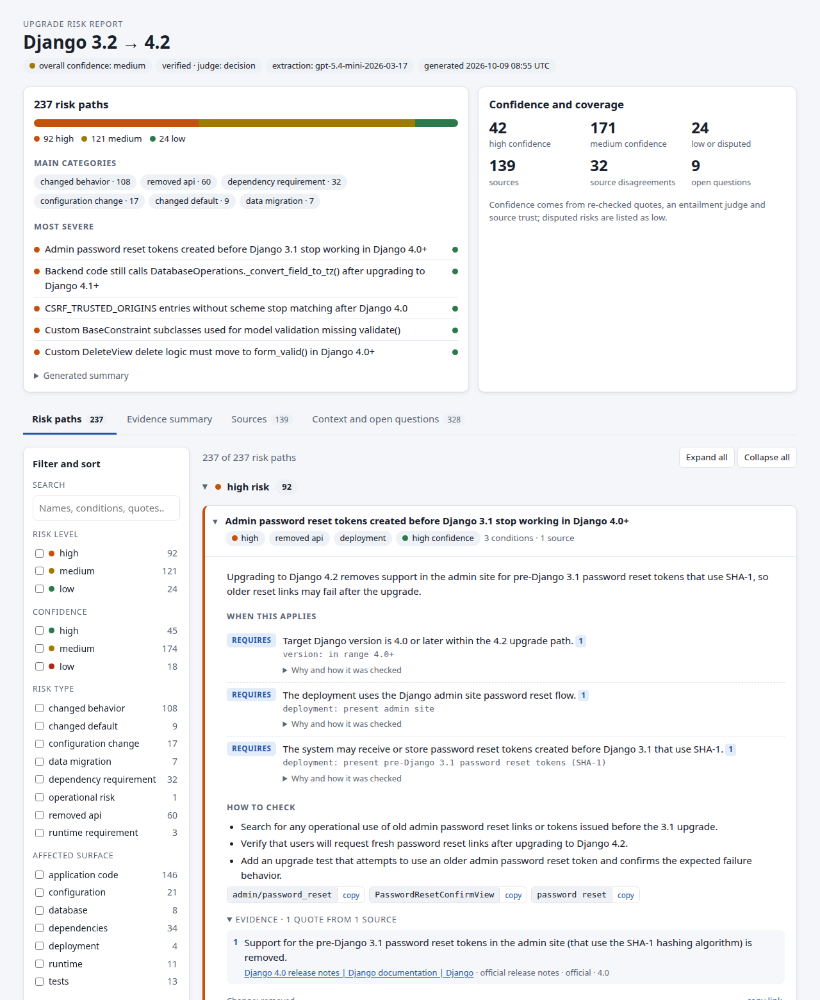
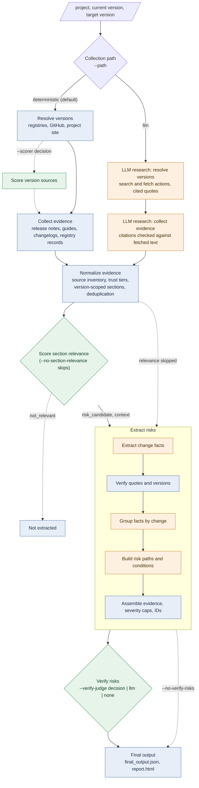

# LLM-Assisted Software Risk Assessment

Upgrading a dependency can break an application through removed APIs, changed defaults, new runtime or
dependency requirements, configuration changes or data migrations. These risks are spread across release
notes, migration guides, changelogs, registries and issue trackers.

Given a project, a current version and a target version (for example Django 3.2 → 4.2), this system gathers
that public documentation and produces a structured **upgrade risk model**. Each risk path lists the
conditions under which the upgrade can break an application, require migration work or create operational
risk. Every condition is grounded in a verbatim quote from a retrieved source, carries a confidence level, and
is phrased so a downstream engine can check it against a codebase or deployment.

*The interactive report generated for Django 3.2 → 4.2: overview, filterable risk paths, and for each path the
conditions under which it applies, how to check for it, and the source quotes behind it.*



Language models are used where judgment is needed: a decision model scores the relevance of documentation
sections and checks whether evidence supports each condition, and an LLM extracts change facts and builds risk
paths. Code does the rest: version resolution, retrieval, quote verification, evidence assembly, conflict
detection, confidence scoring and schema validation. Models cite IDs and code copies the evidence, so a model
cannot invent a source or a quote.

Why it is built this way, and how it handles hallucination, conflicts, scale and evaluation, is in the
[design note](DESIGN_NOTE.md).

## Workflow




Blue steps are code, orange steps use the LLM, and green steps use the decision model (local LiquidAI d1 by
default). Dashed edges are optional. With `--verify-judge llm` the verification judge is an LLM critic
instead, and with `none` it is code only. Every step writes its output to the case directory before the next
one starts, and a failing step is recorded without discarding earlier work.

## Usage


### Setup

Python 3.10 or newer. In this workspace `python` is 3.8, so use `/usr/bin/python3` (3.12).

```bash
/usr/bin/python3 -m venv .venv
.venv/bin/python -m pip install -e '.[test]'

# The default workflow runs the local d1 decision model: CUDA GPU with bf16 (about 6 GB of GPU memory)
/usr/bin/python3 -m venv .venv-d1
.venv-d1/bin/python -m pip install -r requirements-d1.lock   # or: pip install -e '.[d1,test]'
```

`requirements.lock` and `requirements-d1.lock` pin the versions used during validation. If the project is not
installed into `.venv-d1`, run it as `PYTHONPATH=src .venv-d1/bin/python -m upgrade_pipeline …`.

### Quick start

```bash
export LLM_MODEL_NAME=gpt-5.4-mini LLM_BASE_URL=https://api.openai.com/v1 LLM_API_KEY=...

# One upgrade
PYTHONPATH=src .venv-d1/bin/python -m upgrade_pipeline \
  --project React --current-version 17 --target-version 18 --output-dir outputs/react

# All six example upgrades from examples/inputs.json; <output-dir>/final/ collects every final output,
# its report and an index.html linking them
PYTHONPATH=src .venv-d1/bin/python -m upgrade_pipeline \
  --inputs examples/inputs.json --output-dir outputs
```

`python -m upgrade_pipeline` and the installed `upgrade-pipeline` command are the same CLI. The exit code is
0 when every case completed with version-associated evidence, and 2 otherwise.

Progress is logged to stderr as `HH:MM:SS step | message`: resolution, collection counts, relevance, fact
batches and path groups during extraction, verified conditions, and each model as it loads. `--log-level debug|info|warning` (or `-q` for warnings only) applies to every command. Stdout carries one JSON summary line
per case.

### Commands

Without a command the full pipeline runs. Commands re-run one step on saved case directories, so a later step
can be repeated without collecting again.


| Command              | Does                                                                                |
| -------------------- | ----------------------------------------------------------------------------------- |
| `run` (default)      | Resolve, collect, score relevance, extract, verify and write the final output       |
| `normalize DIR…`     | Rebuild `source_inventory.json` and `candidate_sections.json`                       |
| `relevance DIR…`     | Score candidate sections with the relevance decision model                          |
| `extract DIR…`       | Extract risk paths with the extraction LLM                                          |
| `verify DIR…`        | Verify the risk model and write the evidence summary (`--judge decision|llm|none`)  |
| `final DIR…`         | Rebuild `final_output.json` from a saved risk model                                 |
| `report DIR…`        | Rebuild the interactive `report.html` (and an `index.html` for several directories) |
| `evaluate GOLD DIR…` | Check risk models against a gold expectations file                                  |
| `schemas [--check]`  | Regenerate, or check, `schemas/*.schema.json`                                       |


### Arguments of `run`


| Argument                                                                               | Default                       | Description                                                                                               |
| -------------------------------------------------------------------------------------- | ----------------------------- | --------------------------------------------------------------------------------------------------------- |
| `--project`, `--current-version`, `--target-version`                                   |                               | One upgrade. Versions use the interval policy below.                                                      |
| `--inputs FILE`                                                                        |                               | Batch instead of `--project`: a JSON array of `{project, current_version, target_version}` objects        |
| `--output-dir DIR`                                                                     | `outputs/pipeline`            | One subdirectory per case, a batch `summary.json`, and `final/` with every final output                   |
| **Collection**                                                                         |                               |                                                                                                           |
| `--path`                                                                               | `deterministic`               | `deterministic`: heuristic resolver and collector. `llm`: LLM research agent for both.                    |
| `--scorer`                                                                             | `heuristic`                   | Version-source ranking on the deterministic path; `decision` uses the scorer decision model               |
| `--web-search`                                                                         | `auto`                        | Resolver discovery search: `auto` (Brave if a key is set, else DuckDuckGo), `brave`, `duckduckgo`, `none` |
| `--evidence-search`                                                                    | `none`                        | Optional web-search hints for the deterministic collector                                                 |
| `--max-documents`                                                                      | 100                           | Documents collected per case (per-version registry records have their own budget of 60)                   |
| `--max-urls`, `--max-depth`                                                            | 500, 2                        | URLs discovered and link depth followed by the collector                                                  |
| `--resolver-requests`, `--collector-requests`                                          | 100, 200                      | HTTP request budgets per stage                                                                            |
| `--llm-max-steps`                                                                      | 12                            | Model actions per stage on the LLM path                                                                   |
| **Post-collection steps**                                                              |                               |                                                                                                           |
| `--section-relevance` / `--no-section-relevance`                                       | on                            | Score candidate sections; `not_relevant` sections are not extracted                                       |
| `--section-relevance-max-sections`                                                     | 200                           | Relevance calls per case, most trusted sources first                                                      |
| `--extract-risks` / `--no-extract-risks`                                               | on (off with `--offline`)     | Risk extraction with the LLM                                                                              |
| `--extract-max-sections`                                                               | 150                           | Sections sent to extraction, most relevant first                                                          |
| `--verify-risks` / `--no-verify-risks`                                                 | on when extraction runs       | Verification and evidence summary                                                                         |
| `--verify-judge`                                                                       | `decision`                    | Entailment judge: `decision`, `llm`, `none`; `d1` and `jev` force that decision backend                   |
| `--verify-max-conditions`                                                              | 300                           | Judged conditions per case                                                                                |
| **Cache and LLM output**                                                               |                               |                                                                                                           |
| `--cache-dir`                                                                          | `.cache/upgrade-resolver`     | HTTP response cache, reused by default                                                                    |
| `--offline`                                                                            | off                           | Replay the cache with no network requests; LLM steps on only by default are skipped                       |
| `--refresh`                                                                            | off                           | Revalidate cached responses                                                                               |
| `--structured-mode`                                                                    | `json_schema`                 | `json_object` or `prompt` for servers without JSON Schema decoding; responses are always validated        |
| `--max-output-tokens`, `--token-parameter`                                             | 8192, `max_completion_tokens` | Output limit per LLM call; `max_tokens` for older servers                                                 |
| **Models** (override environment variables)                                            |                               |                                                                                                           |
| `--llm-model`, `--llm-base-url`                                                        |                               | Generic LLM for every LLM step                                                                            |
| `--{collection,extraction,judge}-llm-model`, `…-llm-base-url`                          |                               | LLM for one step                                                                                          |
| `--decision-backend`, `--decision-model`, `--decision-revision`, `--decision-base-url` | `d1`                          | Generic decision model for every decision step                                                            |
| `--{scorer,relevance,judge}-decision-{backend,model,revision,base-url}`                |                               | Decision model for one step                                                                               |


### Environment variables


| Variables                                                                                                                     | Used for                                                                                                                                                     | Default                                     |
| ----------------------------------------------------------------------------------------------------------------------------- | ------------------------------------------------------------------------------------------------------------------------------------------------------------ | ------------------------------------------- |
| `LLM_MODEL_NAME`, `LLM_BASE_URL`, `LLM_API_KEY`                                                                               | Every LLM step: risk extraction, the LLM path, the LLM critic judge. Any OpenAI-compatible endpoint, hosted or local; the key is optional for local servers. | none; required for extraction               |
| `LLM_COLLECTION_*`, `LLM_EXTRACTION_*`, `LLM_JUDGE_*`                                                                         | One LLM step (same three suffixes)                                                                                                                           | the generic values                          |
| `DECISION_BACKEND` (`d1` or `jev`), `DECISION_MODEL_NAME`, `DECISION_MODEL_REVISION`, `DECISION_BASE_URL`, `DECISION_API_KEY` | Every decision step: relevance, verification, resolver scoring                                                                                               | local `LiquidAI/d1-3B` at a pinned revision |
| `DECISION_SCORER_*`, `DECISION_RELEVANCE_*`, `DECISION_JUDGE_*`                                                               | One decision step (same five suffixes)                                                                                                                       | the generic values                          |
| `GITHUB_TOKEN`                                                                                                                | Higher GitHub API allowance                                                                                                                                  | anonymous                                   |
| `BRAVE_SEARCH_API_KEY`                                                                                                        | Brave web search                                                                                                                                             | DuckDuckGo HTML                             |


Precedence is step argument > step variable > generic argument > generic variable > default. A step that sets
its own base URL, or a different decision backend, is a separate provider: it uses only its own model name and
key, so a key is never sent to an endpoint it was not configured for. A base URL without an explicit decision
backend selects the remote `jev` API. API keys are read from the environment only and never written to outputs.
The resolved model of each step is printed at start and recorded in every `manifest.json`. A template is in
`[.env.example](.env.example)`; details in [models and default workflow](docs/configuration.md).

### Local LLMs

Local models are supported. Any server exposing the **OpenAI-compatible Chat Completions API** works, such as
vLLM, llama.cpp's `llama-server`, Ollama or LM Studio. Point the LLM at it and run as usual; no key is needed:

```bash
export LLM_BASE_URL=http://localhost:8000/v1 LLM_MODEL_NAME=<served model name>
```

Use `--structured-mode json_object` (or `prompt`) if the server lacks JSON Schema decoding and
`--token-parameter max_tokens` for older servers; responses are validated locally either way. The model needs a
context window of at least 16k tokens and must copy quotes verbatim; weaker models lose coverage (rejected facts
are reported as diagnostics) but cannot introduce unverified evidence. A single step can also run locally, for
example `LLM_JUDGE_BASE_URL` for the critic judge. `--offline` turns LLM steps off even for local servers; see
[local LLMs](docs/configuration.md#local-llms) for a fully local workflow.

### Interval policy

`3.2 → 4.2` includes every release in the 4.0, 4.1 and 4.2 families and excludes 3.2.x; `17 → 18` includes
the 18.x releases. A batch input can set `"version_mode": "exact"` for `current < version <= target`. See
[the resolver](docs/resolver.md).

### Offline and cached runs

Every HTTP response is cached under `.cache/upgrade-resolver/` without expiry. `--offline` replays the cache
with zero network requests: resolution, collection, normalization and the local d1 steps run, while LLM steps
are skipped unless requested explicitly, which is then an error. Saved case directories can be re-processed
step by step with the commands above.

## Findings

Six upgrades were run with the default workflow: heuristic collection, local d1 for relevance and judging, and
`gpt-5.4-mini` for extraction. Each `final_output.json` and `report.html` is in [`outputs/`](outputs), and
[`outputs/final/index.html`](outputs/final/index.html) links them.


| Upgrade              | Risk paths | Severity: critical / high / medium / low | Confidence: high / medium / low | Conditions | Search patterns¹ | Sources | Context facts | Open questions | Disagreements (resolved) | Extraction calls | Run time |
| -------------------- | ---------- | ---------------------------------------- | ------------------------------- | ---------- | ---------------- | ------- | ------------- | -------------- | ------------------------ | ---------------- | -------- |
| Django 3.2 → 4.2     | 214        | 0 / 86 / 113 / 15                        | 50 / 151 / 13                   | 484        | 92%              | 139     | 329           | 5              | 29 (27)                  | 238              | 19 min   |
| React 17 → 18        | 87         | 0 / 17 / 57 / 13                         | 10 / 60 / 17                    | 187        | 80%              | 71      | 159           | 11             | 24 (17)                  | 114              | ²        |
| Kubernetes 1.23 → 1.29 | 153      | 1 / 66 / 77 / 9                          | 39 / 96 / 18                    | 333        | 83%              | 86      | 253           | 21             | 21 (4)                   | 197              | 13 min   |
| PostgreSQL 13 → 16   | 492        | 0 / 118 / 210 / 164                      | 42 / 377 / 73                   | 1,133      | 77%              | 100     | 866           | 52             | 257 (237)                | 548              | 42 min   |
| Next.js 12 → 14      | 206        | 0 / 98 / 94 / 14                         | 64 / 106 / 36                   | 449        | 96%              | 120     | 284           | 65³            | 66 (39)                  | 214              | 19 min   |
| Pydantic 1 → 2       | 218        | 0 / 76 / 119 / 23                        | 39 / 163 / 16                   | 453        | 96%              | 83      | 453           | 5              | 14 (12)                  | 234              | 19 min   |


¹ Share of application conditions (not version conditions) that come with code search patterns.
² React is from an earlier run of the same workflow, before the collector changes for registry catalogs and the
URL-budget reserve; its run time was not recorded separately. The other five ran on the current code.
³ 36 of them are "no evidence was collected for version 14.x.y": patch releases past the 60-record registry
budget, not unknowns about the upgrade (see [Limitations](#limitations)).

- **Grounding.** Every condition in every upgrade cites evidence whose quote was found again in the original
document. The entailment judge reached all of React's conditions, but its 300-condition budget left 184
(Django), 33 (Kubernetes), 833 (PostgreSQL), 149 (Next.js) and 153 (Pydantic) unjudged.
- **Coverage spot checks.** Django has 14 of 16 well-known 3.2 → 4.2 changes as risk paths: the `USE_L10N`
deprecation and the MySQL 8 minimum were cut by the extraction budget. Next.js has all 12 well-known 12 → 14
changes checked, from the Node.js 16.14 and 18.17 minimums to `next export` and `@next/font` being removed.
- **Size varies between runs.** Two Next.js runs on identical documents and relevance labels produced 110 and 206
paths: the LLM split changes more finely the second time (for example one path per `onLoad`, `onReady` and
`onError` handler), with about 18 near-duplicates. Counts are a measure of granularity as much as coverage.
- **PostgreSQL is the largest** because it reads every minor release's notes: 164 of its paths are low, many of
them bug fixes shipped by the upgrade, capped at low severity by the rubric.

### Evaluation against gold sets

`upgrade-pipeline evaluate` scores a risk model against hand-written expectations, one or more checks per
extraction distinction. Gold sets exist for React and Pydantic.


| Distinction                                     | React 17 → 18 | Pydantic 1 → 2 |
| ----------------------------------------------- | ------------- | -------------- |
| Required risk conditions                        | 1/1           | 1/1            |
| Alternative risk paths                          | 1/1           | 1/1            |
| Removed APIs or features                        | 1/1           | 1/1            |
| Changed defaults or behavior changes            | 2/2           | 4/4            |
| Runtime and dependency requirements             | 2/2           | 1/2            |
| Configuration changes                           | 1/1           | 2/2            |
| Migration steps                                 | 1/2           | 2/2            |
| Known incompatibilities                         | 1/2           | (none stated)  |
| Suspected but not clearly supported             | 2/2           | 1/1            |
| Contextual facts that are not risk conditions   | 2/2           | 0/2            |
| **Total**                                       | **14/16**     | **13/16**      |


Failed checks:


| Upgrade  | Check                          | What happened                                                                                                     |
| -------- | ------------------------------ | ----------------------------------------------------------------------------------------------------------------- |
| React    | `unmountComponentAtNode` → `root.unmount()` | Two paths cover the deprecation, but the migration step says "the recommended non-deprecated unmount approach" instead of naming `root.unmount()` |
| React    | React Native not yet supported | The decision model rated the upgrade guide's React Native note not relevant, so it was never extracted            |
| Pydantic | `BaseSettings` moved to `pydantic-settings` | Found, but typed `removed_api` instead of `dependency_requirement`                                                 |
| Pydantic | `allow_reuse` no longer needed | A relaxation, but extracted as a medium-severity behavior change instead of context                                |
| Pydantic | Rust regex is faster           | The section was extracted as a risk (the Rust engine drops some regex features; `regex_engine` restores Python's), but the speed-up was not kept as a separate context fact |


The Pydantic set includes a trap that passes: pydantic.dev also hosts another product's migration guide, which
the collector kept, and none of its content became a Pydantic risk. Both evaluations are reproduced with the
commands in [Reproducing the results](#reproducing-the-results).

## Reproducing the results

The six example upgrades (Django 3.2 → 4.2, React 17 → 18, Kubernetes 1.23 → 1.29, PostgreSQL 13 → 16,
Next.js 12 → 14, Pydantic 1 → 2) are listed in `[examples/inputs.json](examples/inputs.json)`. They were run with the default
workflow and this configuration:


| Setting                                              | Value                                                                                  |
| ---------------------------------------------------- | -------------------------------------------------------------------------------------- |
| Hardware                                             | NVIDIA RTX 3080 Laptop GPU (16 GB), CUDA with bf16                                     |
| Python environment                                   | `.venv-d1` from `requirements-d1.lock` (torch 2.14.1, transformers 5.14.1)             |
| LLM (extraction)                                     | `gpt-5.4-mini` via `https://api.openai.com/v1` (resolved to `gpt-5.4-mini-2026-03-17`) |
| Decision model (relevance, verification)             | default: local `LiquidAI/d1-3B` at revision `051bcc464b01b9f92942b364d9586b0ef5912432` |
| `DECISION_*`, `GITHUB_TOKEN`, `BRAVE_SEARCH_API_KEY` | not set (so web search used DuckDuckGo)                                                |
| Arguments                                            | defaults only: heuristic resolver and collector, all budgets at their defaults         |


```bash
# 1. Setup (once)
/usr/bin/python3 -m venv .venv-d1
.venv-d1/bin/python -m pip install -r requirements-d1.lock

# 2. Environment: only the LLM is configured; everything else uses defaults
export LLM_MODEL_NAME=gpt-5.4-mini
export LLM_BASE_URL=https://api.openai.com/v1
export LLM_API_KEY=<your OpenAI key>
unset DECISION_BACKEND DECISION_MODEL_NAME DECISION_BASE_URL GITHUB_TOKEN BRAVE_SEARCH_API_KEY

# 3. Run all six upgrades
PYTHONPATH=src .venv-d1/bin/python -m upgrade_pipeline \
  --inputs examples/inputs.json --output-dir outputs \
  > outputs/summary.jsonl 2> outputs/run.log
```

Each upgrade gets a case directory (`outputs/01-django/`, …), and `outputs/final/`
collects every `final_output.json` as `<project>_<current>_to_<target>.json`, each report as `.html`, and an
`index.html` linking them. The log shows progress per step; stdout has one JSON summary line per upgrade. The
first run downloads the d1 weights (about 6 GB) into the Hugging Face cache: `$HF_HOME` if set, otherwise
`.cache/huggingface/` in the project. Each upgrade took 13 to 42 minutes on this hardware with the default
budgets (see [Findings](#findings) and [Limitations](#limitations)), most of it in LLM extraction.

**What is and is not reproducible.**

- *Sources*: responses are cached under `.cache/upgrade-resolver/` and reused, so a rerun on the same machine
reads the same documents. A fresh machine fetches today's pages, which may have changed. Copy that cache
directory to reproduce the exact sources.
- *Decision model*: d1 is pinned to a revision and runs locally, so the same inputs give the same scores, up to
small GPU floating-point differences that can move a section sitting exactly at a threshold.
- *LLM extraction*: hosted model output varies between runs, so the set and wording of risk paths will differ.
Every condition is still re-verified against the sources, so variation shows up as coverage, not unsupported
claims.
- *Without API calls*: `final_output.json` and `report.html` can be rebuilt from saved case directories at no
cost, and outputs checked against the React and Pydantic gold sets (using the `.venv` from [Setup](#setup)):

```bash
.venv/bin/upgrade-pipeline final  outputs/0*-*
.venv/bin/upgrade-pipeline report outputs/0*-*
.venv/bin/upgrade-pipeline evaluate evals/react-17-18-distinctions.json outputs/02-react
.venv/bin/upgrade-pipeline evaluate evals/pydantic-1-2-distinctions.json outputs/06-pydantic
```


## Outputs


| File (per case)                                     | Contents                                                                                                                                                                                                                                                                                                                 |
| --------------------------------------------------- | ------------------------------------------------------------------------------------------------------------------------------------------------------------------------------------------------------------------------------------------------------------------------------------------------------------------------ |
| `report.html`                                       | Interactive report for people: summary, filterable risk paths with conditions, quotes and source links, evidence summary, sources, contextual facts and open questions. Self-contained (no network), generated by default.                                                                                               |
| `final_output.json`                                 | The deliverable: summary, source inventory, risk paths with conditions, evidence, migration steps and code search patterns, contextual facts, open questions, overall confidence, evidence summary, provenance. Validated against `[schemas/final_output.schema.json](schemas/final_output.schema.json)` before writing. |
| `source_inventory.json`                             | Sources ranked by trust tier, with why each is relevant and why others were excluded                                                                                                                                                                                                                                     |
| `candidate_sections.json`                           | Version-scoped, topic-tagged, deduplicated sections with relevance scores                                                                                                                                                                                                                                                |
| `extracted_facts.json`                              | Verified change facts, rejected facts with reasons, and fact groups                                                                                                                                                                                                                                                      |
| `risk_model.json`                                   | Working risk model with full verification detail                                                                                                                                                                                                                                                                         |
| `evidence_summary.json`, `grounding_report.json`    | High, medium and low-confidence or disputed risks, source disagreements, open questions; every check per condition                                                                                                                                                                                                       |
| `resolution.json`, `evidence.json`, `manifest.json` | Resolved versions, collected documents, configuration and step outcomes                                                                                                                                                                                                                                                  |

**`evidence.json` is left out of the repository.** It holds the full text of every collected document, which
makes it the largest file by far: 2 to 171 MB per upgrade, 171 MB for Django alone. `final_output.json` already
carries the quote, URL and trust tier of every piece of evidence it uses,
and `final` and `report` rebuild without `evidence.json`. Only re-running verification needs it.
To regenerate it, run collection alone, which makes no model calls:

```bash
.venv/bin/upgrade-pipeline run --inputs examples/inputs.json --output-dir outputs/evidence \
  --no-section-relevance --no-extract-risks --no-verify-risks
# then copy outputs/evidence/<case>/evidence.json into the matching case directory
```

With the HTTP cache from the original run (`.cache/upgrade-resolver/`, add `--offline`) this reproduces the
same documents; without it, pages are fetched again and may have changed since.


### Interactive report

Every run also writes `report.html`, a self-contained page for reading the results: an overview of severity,
categories and the most severe risks; risk paths grouped by level with search and filters; and, for each path,
the conditions under which it applies, migration and validation steps, copyable code search patterns, and the
numbered source quotes behind every condition. Further tabs show the evidence summary, the source inventory,
contextual facts, open questions and run diagnostics. The screenshot at the top of this page shows it.

## Validation

```bash
.venv/bin/python -m pytest -q                       # tests with scripted models and fixtures, no network
.venv/bin/upgrade-pipeline schemas --check          # committed JSON Schemas match the code
.venv/bin/upgrade-pipeline evaluate evals/react-17-18-distinctions.json outputs/02-react
```

Inside the pipeline: structured outputs restricted to closed value lists; quotes checked against the cited
section during extraction and again against the original document during verification; an entailment judge
per condition; a deterministic confidence rubric; conflict detection with a fixed source-precedence policy;
schema validation before every output is written. `evals/` holds hand-written gold sets for React 17 → 18
(16 checks over ten extraction distinctions: required conditions, alternative paths, removed APIs and so on) and Pydantic 1 → 2 (16 checks over nine).

## What is trusted

- **Trusted:** text retrieved from official sources: the project site and its subdomains, the project
repository and the package registry record. Trust tiers come from the resolver's identity or the registry
record, never from a model, and a third-party page never overrides an official one.
- **Not trusted as evidence:** search snippets, model knowledge, page titles alone, and anything a model
writes. Fetched text is treated as data, never as instructions.
- **Verified but not proven:** a verbatim quote proves the source says it, not that the model read it
correctly. The judge and the confidence rubric narrow that gap without closing it.


## Limitations

- **Public documentation only.** The system extracts risks from what projects publish. It does not analyze a
codebase, run an upgrade, or produce a complete migration plan for a production system; whether a risk
applies to a given application is for a downstream assessment to decide.
- **Bounded, partial coverage.** Document, URL, request and section budgets apply, and results are always
marked `partial`. Missing evidence is reported as an open question, never as proof that nothing changed.
- **Budgets sized for a personal LLM budget.** The default limits were chosen so the six-upgrade run fits
the time and API spend of one person paying for it, not to maximize recall:

  | Stage | Limit |
  |---|---|
  | Collection | 100 documents, 60 registry records, 500 URLs, depth 2 and 200 HTTP requests per upgrade |
  | Relevance | 200 sections scored |
  | Extraction | 150 sections sent to the LLM |
  | Verification | 300 conditions judged |

  With them, each upgrade ran in 13 to 42 minutes with 114 to 548 extraction calls to `gpt-5.4-mini`. The
  cost is recall on large upgrades. Django, Kubernetes and Pydantic exceeded all three model budgets:
  Pydantic 1 → 2 had 366 of 566 sections never scored and 378 relevant sections not extracted, and Django
  lost the `USE_L10N` deprecation and the MySQL 8 minimum that way. PostgreSQL had 833 conditions left
  unjudged.
  Every overrun is listed in the run diagnostics, and each limit is a command-line argument (see
  [Arguments of `run`](#arguments-of-run)), so a larger budget only needs larger values.
- **Discovery heuristics can miss documents.** Collection relies on links, sitemaps, release records and URL
patterns. Milestone release notes are derived from linked patch-release notes when not linked directly, but
documentation with unusual layouts or JavaScript-only pages can be missed.
- **Relevance filtering can drop real risks.** Sections the decision model rates `not_relevant` are not
extracted. Its scores are uncalibrated and have produced false negatives, such as React's note that React
Native support would ship later.
- **Unversioned documentation can get the wrong version.** A page with no version of its own (a "latest"
docs page) takes the versions of the page that linked to it. Pydantic's official V1 → V2 migration guide was
reached through a link from a 2.13-era page, so the paths built from it say the changes start at "2.13.0+"
when they arrived in 2.0. The changes themselves are extracted correctly. The version conditions would make
a downstream engine skip them for upgrades that stop before 2.13. The fix is to treat a version inherited
only through a link as the whole interval, or to read the milestone from the page body ("Pydantic V2"); it
is not implemented yet.
- **Patch versions without documents become open questions.** Every resolved version with no collected
document gets an open question. For a registry catalog with many patch releases (Next.js: 102 versions,
60-record budget), that produces dozens of "no evidence was collected for version 14.x.y" questions about
releases that publish no notes of their own. They should be one run diagnostic, with questions kept for
documentation milestones.
- **LLM results vary between runs.** Grounding checks limit what can be claimed, not what is found; two runs
can extract different sets of paths.
- **Confidence is a policy, not a probability.** Thresholds and rubrics are documented choices that have not
been calibrated against labeled data beyond two gold sets.
- **Conflict detection is narrow.** It compares facts with the same normalized subject name across four
disagreement kinds. Contradictions in prose, differently named mentions of the same API, and requirements
that legitimately change across patch releases are handled imperfectly.
- **Heuristic identity and trust.** The project's site is approximated by its last two domain labels (wrong for
e.g. `co.uk`), and resolver identity is a scored heuristic, not ownership verification.
- **Hardware and cost.** The default decision model needs a CUDA GPU with bf16; the remote `jev` backend is the
alternative. LLM steps make many calls per upgrade (one per batch of sections, per change group, and so on).


## Documentation

[Design note](DESIGN_NOTE.md) · [Pipeline and commands](docs/pipeline.md) · [Models and default workflow](docs/configuration.md) ·
[Version resolver](docs/resolver.md) · [Source scoring](docs/source-scoring.md) ·
[Evidence collection](docs/evidence-collection.md) · [LLM path](docs/llm-pipeline.md) ·
[Risk extraction](docs/risk-extraction.md) · [Verification](docs/verification.md) ·
[Model interface](docs/inference.md) · [Web search](docs/web-search.md)
## License

The code and documentation are released under the [MIT License](LICENSE). The files in `outputs/` quote short
excerpts from the upgraded projects' public documentation (Django, React, Kubernetes, PostgreSQL, Next.js and
Pydantic) as evidence; those excerpts remain under their original projects' licenses and are linked to their
sources.
